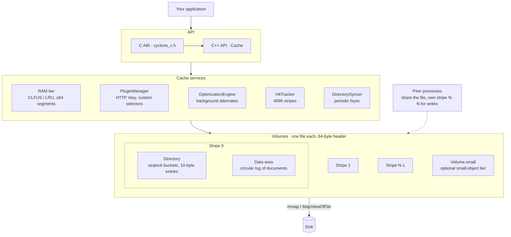
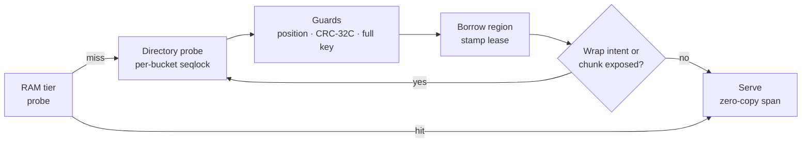

# Cyclone Cache

[](https://github.com/We-Amp/cyclone-cache/actions/workflows/ci.yml)
[](LICENSE)
[](#requirements)
[](#building)

**A lock-free, memory-mapped, multi-process disk cache for C++23 — and a
C ABI for everything else.** Cyclone is the persistent storage engine behind
mod_pagespeed 2.1, built on the on-disk design of Apache Traffic Server: a
circular write log per stripe, a 10-byte directory entry, phase-bit eviction,
and a scan-resistant CLFUS RAM tier. Reads take no lock. Many processes can
share one cache file. Large values are served as zero-copy views into the
mapped file.

It is a general-purpose blob store for anything keyed by a hash — HTTP
responses and their content-negotiated variants, rendered pages, transcoded
images, or the [KV-cache tensors of an LLM prefix](#kv-cache-for-llm-inference).

**Status:** v0.1.0, pre-release. On-disk format v8. The API is not yet frozen;
pin a commit when you depend on it. The numbers below are from one machine
(Apple M5 / macOS 27) unless they name another; expect different absolutes
on Linux/NVMe.

## Cyclone in numbers

Measured on 2026-09-23 at commit `87cd986` — Apple M5 (10 cores), macOS
27.0, Release build, bundled SHA-256, single thread unless stated, median of
three runs. Every number below is reproducible with the commands in
[Reproducing the numbers](#reproducing-the-numbers).

| Number | What it means |
|---:|---|
| **0.38 µs** | p50 for a warm hit served from the mapped file (4 KB object) — **2.3 M reads/s** on one thread |
| **17.6 M reads/s** | 4 threads hammering the mmap tier (512 B objects), 3.3× one thread; 21 M/s at 16 threads |
| **2.6 µs** | p50 for a 4 KB write, 21 µs p99 — **229 K writes/s**, no per-write fsync |
| **11–13 GB/s** | single-thread first read of a 64 KB–1 MB object, checksum verified (hardware CRC-32C) |
| **~1 GB/s** | sustained single-thread write of 2 MiB values over a 4 GiB dataset ([KV benchmark](doc/kv-cache-benchmark.md)) |
| **0.4 µs** | to acquire a zero-copy view of a 1 MB object once it has been verified — cost is independent of object size |
| **0** | stripe locks on the read path — per-bucket seqlocks, CRC-32C and read leases instead |
| **10 bytes** | per directory entry; 132-byte document header; 1 TiB addressable per stripe |
| **N processes** | may open the same cache file; each owns `stripe % N` for writes, all read everything |
| **64** | content variants ("alternates") per key — compressed, transcoded, quantized… |
| **657** | Catch2 test cases, about 150 K assertions, plus libFuzzer harnesses; CI on Linux, macOS, Windows |

## Architecture

One `Cache` façade owns the cross-cutting services and a set of volumes. Each
volume is one file on disk, divided into stripes; each stripe is an
independent append-only log with its own directory.



The read hot path never takes a lock. A hit is a directory probe under a
seqlock, a few guards, and a span into the mapped file:



Writers take exactly one stripe lock — the stripe's mutex in `commit_write` —
and publish a directory entry only after the document bytes are durable, so a
crash can never leave an entry pointing at torn data. Eviction never scans:
when a stripe's log wraps, the previous lap stays readable, and a clean
frontier ahead of the write cursor drops it one chunk at a time, only as the
new lap needs the bytes. The FIFO order still costs some hit ratio against
an LRU on large-value tiers (see the
[KV benchmark](doc/kv-cache-benchmark.md)). Details, with file:line anchors, live in
[doc/architecture.md](doc/architecture.md) and
[doc/multi-process.md](doc/multi-process.md).

## Why Cyclone

- **Lock-free reads that scale.** Readers touch only per-thread sharded
  state (read anchors, borrow shards, hit counters, RAM-cache segments) —
  see the [numbers](#cyclone-in-numbers).
- **Zero-copy.** `ReadHandle::mapped_view()` aliases the mapped file;
  `content_file_offset()` feeds `sendfile`. A lease/borrow protocol keeps a
  writer from wrapping over bytes a reader is still holding.
- **Multi-process by design.** Put the directory in the file
  (`MultiProcessConfig`), give each process an index, and worker processes
  share one cache with seqlock + CRC-32C torn-read detection — no daemon, no
  IPC.
- **Crash-safe by ordering, not by fsync.** Data is durable before the
  directory entry is published; with the mmap directory the periodic
  `DirectorySyncer` bounds the loss window, and `sync_on_write` is opt-in.
- **Scan-resistant RAM tier.** CLFUS (Clock LRU Frequency Size) admits on the
  second touch and ranks by `(hits + 1) / (size + 256)`, so a crawler pass
  cannot flush your hot set.
- **Variants under one key.** Up to 64 alternates per key (Brotli, gzip,
  WebP, AVIF, JPEG XL, custom IDs) with a built-in RFC 7234 HTTP selector
  and a background engine that generates alternates after the write.
- **Small-object tier.** Carve off a percentage of a volume so payload churn
  can never evict your manifests and metadata.
- **Portable.** Linux, macOS, Windows; CMake presets for x64/arm64/universal
  and Zig cross-builds; hermetic build with a bundled SHA-256.
- **`std::expected` everywhere.** No exceptions; coroutine `Task<T>` API
  alongside the `_sync` calls.

## Quick start

```cpp
#include "cyclone/cache.hpp"
#include "cyclone/key.hpp"

#include <span>
#include <string>

using namespace cyclone;

int main() {
  CacheConfig config;
  config.set_ram_cache_size(64_MB);        // 0 disables the RAM tier

  auto created = Cache::create(config);
  if (!created) return 1;
  Cache& cache = *created.value();

  // One file, 1 GB; stripes are sized automatically.
  if (!cache.add_volume("/var/cache/myapp/cache.dat", 1_GB)) return 1;
  if (!cache.start()) return 1;

  CacheKey key = CacheKey::from_url("https://example.com/page.html");

  std::string body = "Hello, World!";
  auto bytes = std::as_bytes(std::span{body});
  if (auto w = cache.write_sync(key, bytes.size())) {
    w->write_sync(bytes);
    w->close_sync();                       // publishes the directory entry
  }

  if (auto r = cache.read_sync(key)) {
    std::span<const std::byte> content = r->content();   // zero-copy on a disk hit
    // ... use content before r goes out of scope
  }

  cache.stop();                            // close all handles first
}
```

[examples/basic_usage.cpp](examples/basic_usage.cpp) is the same flow with
headers, stats, and the coroutine API (`Task<T>::sync_wait()`).

## Building

```bash
cmake -B build -DCMAKE_BUILD_TYPE=Release -DCYCLONE_USE_BUNDLED_SHA256=ON
cmake --build build -j
./build/cyclone-tests                 # run the test binary directly (see note)
./build/cyclone-tests "[security]"    # one tag; --list-tags shows them all
```

On Windows the binary is `build\Release\cyclone-tests.exe`.

Run the test binary directly rather than `ctest -j`: the Catch2 cases share a
fixed on-disk temp path, so parallel test *processes* race on it.

`CMakePresets.json` carries per-platform presets — `linux-x64`,
`linux-arm64`, `macos-arm64`, `macos-x64`, `macos-universal`, `windows-x64`,
`windows-arm64` (each with a `-release` variant), `*-zig` cross-compile
presets, and `dev` / `asan` / `tsan` / `ci-release` for contributors:

```bash
cmake --preset macos-arm64 && cmake --build --preset macos-arm64
```

Windows/vcpkg presets need `VCPKG_ROOT`; the `*-zig` presets disable tests,
examples, and benchmarks.

### Requirements

- CMake 3.20+ and a C++23 compiler (CI builds with each GitHub runner's
  default toolchain: GCC on Ubuntu, Apple Clang on macOS, MSVC on Windows;
  LLVM 20 is the formatting/lint toolchain, see [CONTRIBUTING.md](CONTRIBUTING.md))
- OpenSSL **or** `-DCYCLONE_USE_BUNDLED_SHA256=ON` (hermetic, what CI uses)
- Catch2 3 for tests (found via `find_package`, else fetched at configure)

### Build options

| Option | Default | Description |
|--------|---------|-------------|
| `CYCLONE_BUILD_TESTS` | ON | Build the `cyclone-tests` Catch2 binary |
| `CYCLONE_BUILD_HTTP_PLUGIN` | ON | Build the RFC 7234 alternate-selection plugin (defines `CYCLONE_HTTP_PLUGIN` for consumers) |
| `CYCLONE_BUILD_EXAMPLES` | ON | Build `examples/` |
| `CYCLONE_BUILD_BENCHMARKS` | ON | Build `cache_benchmark`, `performance_baseline`, `concurrent_read_bench`, `kv_bench`, `kv_churn`, `kv_churn_policy`, `crc32c_bench`, and on Apple `kv_gpu_metal` |
| `CYCLONE_BUILD_CUDA_BENCHMARKS` | OFF | Also build `kv_gpu_cuda` (needs the CUDA toolkit; not on Windows) |
| `CYCLONE_BUILD_FUZZERS` | OFF | Build the libFuzzer harnesses in `fuzz/` (Clang only) |
| `CYCLONE_ENABLE_ASAN` | OFF | AddressSanitizer for a quick local check |
| `CYCLONE_USE_BUNDLED_SHA256` | OFF | Bundled SHA-256 instead of OpenSSL; ON in CI, required where OpenSSL headers are absent |

### Consuming

There is no tagged release yet — pin a commit:

```cmake
include(FetchContent)
FetchContent_Declare(cyclone-cache
  GIT_REPOSITORY https://github.com/We-Amp/cyclone-cache.git
  GIT_TAG        <commit>)
set(CYCLONE_BUILD_TESTS OFF)
set(CYCLONE_USE_BUNDLED_SHA256 ON)
FetchContent_MakeAvailable(cyclone-cache)
target_link_libraries(myapp PRIVATE cyclone-cache)
```

`cmake --install` also exports `cyclone::cyclone-cache` for
`find_package(cyclone-cache)`.

## KV cache for LLM inference

Cyclone was built as an HTTP object cache, but the primitives it ships are the
ones an **LLM KV-cache offload / prefix-caching tier** needs: a whole-file
`MAP_SHARED` mapping, reads that hand back a `std::span` aliasing the page
cache without copying, several processes sharing one cache file with lock-free
cross-process reads, and a lease protocol that keeps a borrowed region intact
while you stream it to the device. Persist the key/value tensors of a prompt
prefix to node-local NVMe, and the next request that shares the prefix loads
them instead of recomputing them.

Where it fits, measured against LMDB, RocksDB and file-per-block in
[doc/kv-cache-benchmark.md](doc/kv-cache-benchmark.md): a **node-local,
multi-process tier for large blocks (2–32 MiB)** that evicts on its own. On
Linux/NVMe it reads cold 8–32 MiB blocks faster than every peer (3.0–3.4
GB/s), serves four reader processes 1.3× faster than LMDB, and under
concurrent churn keeps a 3–4× lower hit-latency tail than LMDB with an LRU;
with wrap retention on (now the default), a bounded tier meets the
benchmark's pre-registered bar against LMDB on that latency clause. It is not a general LMDB
replacement: warm reads are in the same class, small blocks read cold
behind LMDB (512 KiB at 0.7× its rate; below 256 KiB, where no readahead
hint is issued, far behind), writes run at about 1 GB/s per thread behind
file-per-block, and single-threaded churn serves 0.7–0.8× LMDB.

- **Zero-copy loads.** On a disk hit `content()` aliases the mapped volume;
  acquiring a view costs about 0.4 µs regardless of size. For device
  transfer, register the whole volume mapping once (`volume_files()`,
  `content_file_offset()`); pinning each returned span is slower than
  staging.
- **Safe aliasing under eviction.** The borrow + lease pins the region while
  your handle is open; `renew_lease_strict()` and `ns_until_forced_wrap()`
  tell you exactly when to de-alias.
- **One cache, many workers.** Tensor-parallel ranks or replicas on one node
  share a single file: each owns a slice of stripes for writes, all read
  everything with no locks.
- **Restart-warm index.** With the mmap directory the index lives in the
  file, so a restart needs no rebuild step. Data pages still come back from
  disk, and each first read re-verifies its checksum.
- **Variants per prefix.** Up to 64 alternates per key, IDs 128–255 reserved
  for your own scheme — fp16 / fp8 / int4 copies of the same prefix, chosen
  at read time.
- **Eviction is FIFO by wrap, not LRU.** By default (wrap retention) a
  stripe's previous lap stays readable after the log wraps, until the new
  lap actually needs its bytes, so a stripe holds close to its full capacity.
  The disk tier has no scan resistance (CLFUS covers only the RAM tier, which
  a KV tier normally disables), so under churn it still trails an LRU by
  3.5-4 hit-ratio points. The opt-out, `wrap_retention = false` (flush
  mode), drops the whole previous lap at the wrap and costs about 9 points:
  on a 2 MiB-block, 4 GiB churn run the hit ratio was 0.788 with retention
  and 0.726 flushing (Zipf), 0.660 and 0.614 with scans.
- **Bring your own hash.** `CacheKey::from_digest()` takes a raw 32-byte
  digest, so a rolling hash over token blocks is the key; prefix chaining
  policy stays in your connector.

```cpp
// prefix_digest: your 32-byte hash over the token prefix (full or chunked)
CacheKey key = CacheKey::from_digest(prefix_digest);

if (auto w = cache.write_sync(key, kv_blob.size())) {   // store
  w->set_header(layout_meta);       // dtype, layers, seq_len, page layout…
  w->write_sync(kv_blob);
  w->close_sync();
}

if (auto r = cache.read_sync(key)) {                    // load, zero-copy
  std::span<const std::byte> kv = r->content();        // aliases the mmap'd pages
  copy_to_device(kv.data(), kv.size());                 // while the handle is open
}
```

Sizing for KV blobs: raise `max_object_size` (default 64 MB; `0` removes the
bound; the format tops out just under 4 GiB) and set `stripe_size` larger than
your largest value — a document must fit in one stripe, and one that cannot is
refused with `NoSpace`. Set `ram_cache_size = 0`
and let the OS page cache be the RAM tier. First-read checksum verification
is cheap with hardware CRC-32C, and multi-process mode forces it on. Cyclone
is a node-local tier behind a KV connector — it is not a distributed store,
has no GPU-direct or RDMA path, and ships no Python bindings today. Write
bandwidth at 2 MiB is about 1.5 GB/s per thread on Linux/NVMe (`kv_bench`:
1.52 GB/s, against 1.46 for one file per block). A producer that generates
the blob itself can fill `w->reserve(n)` in place instead of calling
`write_sync()`, which saves one copy of it.

## Concepts

**Keys** are SHA-256 digests: `CacheKey{"any string"}`,
`CacheKey::from_url(url, host)`, or `CacheKey::from_digest(bytes)` when you
already have a hash. `segment_hash()` picks the stripe, `bucket_hash()` the
bucket, and a 12-bit `tag()` is what the directory stores — the full key is
re-verified against the document header on every hit, so a tag collision is a
clean miss, never a wrong answer.

**Stripes** are the unit of everything: one directory, one circular write log,
one writer lock, one owner process. A volume gets about `size / 32 MB` stripes
automatically (rounded, clamped to 1–16); explicit `stripe_size` values are
floored at 128 MB.

**Persistence.** The data area is always on disk, but the *directory* is
in-memory unless you enable the mmap directory (`multi_process_config.enabled`,
usable with a single process too). Without it a cache starts empty on every
open. With it, the index lives in the file and survives restarts; the
`DirectorySyncer` (`directory_sync_interval`, default 30 s) bounds what a
crash can lose — entries published since the last sync, and an in-place
overwrite that was not yet synced may serve its prior value.

**Object size.** A write above `max_object_size` (default 64 MB, `0` =
unbounded) fails with `ObjectTooLarge`; a document that cannot fit in one
stripe's data area, or exceeds the format's ~4 GiB record limit, fails with
`NoSpace`. Nothing is truncated silently.

**The RAM tier** (CLFUS or LRU, sharded into up to 64 *segments* — RAM-cache
shards, unrelated to stripes) is populated on the alternate read path for
objects up to 32 KB. A plain `read_sync` reads from it but never repopulates
it, and is otherwise served straight from the mapped file — which is what
every "hit" in the [numbers](#cyclone-in-numbers) measures.

**Eviction is FIFO by wraparound.** When a stripe's write cursor reaches the
end it wraps. By default (wrap retention) the previous lap stays readable
until the write cursor actually needs its bytes: a clean frontier moves ahead
of the cursor one chunk at a time, and it waits only for borrows in the chunk
it is about to cross. Nothing is scanned. The opt-out is flush mode,
`CacheConfig::wrap_retention = false` (C API: `disable_wrap_retention = 1`):
the wrap flips the stripe's phase bit and every entry from the previous lap
is instantly stale, so a stripe holds about half its size on average. On a
churning KV workload retention lifts the hit ratio from 0.73 (flush) to 0.79
([doc/api-reference.md](doc/api-reference.md#wrap-retention)). The mode is
persisted per volume, so every process sharing a cache must use the same
setting; a volume created by a build whose default was flush is reset cold
on its first open by a default-configured process
([upgrading](doc/api-reference.md#wrap-retention)). Pair either mode with the
small-object tier when some entries must outlive payload churn.

**Alternates** are variants stored under one key in a singly linked chain:
`write_alternate_sync(key, AlternateId::Brotli, len)`, then
`read_alternate_sync(key, selector, ctx)` to pick the best one for a request.
`AlternateId::Custom` and above are yours.

**Tiers.** `Tier::kSmall` routes an operation to the sidecar `<path>.small`
volume created by `CacheConfig::small_tier_percent`. The two tiers are separate
keyspaces and the small tier has no RAM cache. Both volumes need at least one
128 MB stripe (≈256 MB total single-process, `(N + 1) × 128 MB` with N
processes); below that the tier is silently disabled — check
`Cache::small_tier_active()`.

**Read leases.** A disk hit borrows its region and stamps a lease
(`read_lease_duration`, default 5 s). A writer that needs to wrap over a
borrowed region defers instead, up to `lease_wrap_ceiling` (60 s) per episode.
Close handles promptly; renew long holds with `renew_lease_strict()` and poll
`ns_until_forced_wrap()` when you alias `mapped_view()` for a long time.

**Multi-process.** With `multi_process_config.enabled`, the directory lives in
the cache file as a shared `MmapDirectory`. Process *i* of *N* writes only the
stripes where `stripe % N == i` (`CacheError::NotOwned` otherwise) and reads
all of them; readers detect torn documents by CRC-32C and retry. Enable
`cross_process_ram_coherence` to have a RAM-tier hit re-validated against the
shared directory's bucket version, so a peer's purge is never served stale.
The file must live on a filesystem with working byte-range locks (not NFS or
overlayfs); `CacheStats::volumes_with_degraded_reset_gate` tells you if it
does not.

## API overview

Everything fallible returns `std::expected<T, CacheError>`; every operation
takes an optional trailing `Tier` (default `Tier::kDefault`).

```cpp
class Cache {
  static std::expected<std::unique_ptr<Cache>, CacheError> create(const CacheConfig&);

  std::expected<void, CacheError> add_volume(const std::string& path, size_t size);
  std::expected<void, CacheError> add_volume(const VolumeConfig&);
  std::expected<void, CacheError> start();
  void stop();

  // Synchronous
  std::expected<ReadHandle,  CacheError> read_sync  (const CacheKey&, Tier = Tier::kDefault);
  std::expected<WriteHandle, CacheError> write_sync (const CacheKey&, uint64_t content_length, Tier = Tier::kDefault);
  std::expected<void, CacheError>        remove_sync(const CacheKey&, Tier = Tier::kDefault);
  std::expected<bool, CacheError>        exists_sync(const CacheKey&, Tier = Tier::kDefault);

  // Coroutines — drive with Task<T>::sync_wait() or your own executor
  Task<std::expected<ReadHandle,   CacheError>> open_read  (const CacheKey&, Tier = Tier::kDefault);
  Task<std::expected<WriteHandle,  CacheError>> open_write (const CacheKey&, uint64_t content_length, Tier = Tier::kDefault);
  Task<std::expected<UpdateHandle, CacheError>> open_update(const CacheKey&);   // in-place header rewrite
  Task<std::expected<void, CacheError>>         remove     (const CacheKey&, Tier = Tier::kDefault);
  Task<std::expected<bool, CacheError>>         exists     (const CacheKey&, Tier = Tier::kDefault);

  // Alternates (content variants under one key, max 64)
  std::expected<std::vector<AlternateInfo>, CacheError> list_alternates_sync(const CacheKey&, Tier = Tier::kDefault);
  std::expected<WriteHandle, CacheError> write_alternate_sync (const CacheKey&, AlternateId, uint64_t content_length, Tier = Tier::kDefault);
  std::expected<ReadHandle,  CacheError> read_alternate_sync  (const CacheKey&, const StorageAlternateSelector&, const AlternateSelectionContext&, Tier = Tier::kDefault);
  std::expected<void, CacheError>        remove_alternate_sync(const CacheKey&, AlternateId, Tier = Tier::kDefault);

  // Introspection
  CacheStats stats() const;                         // hits, misses, evictions, wrap and lease telemetry, …
  uint64_t total_capacity() const;  uint64_t bytes_used() const;
  std::vector<VolumeFileInfo> volume_files() const; // on-disk names are fingerprinted
  bool small_tier_active() const;
  bool cross_process_ram_coherence_active() const;

  PluginManager& plugin_manager();
  OptimizationEngine* optimization_engine();
};
```

```cpp
class CacheKey {
  static constexpr size_t kDigestSize = 32;                 // SHA-256
  explicit CacheKey(std::string_view s);
  explicit CacheKey(std::span<const std::byte> data);
  static CacheKey from_url(std::string_view url, std::string_view hostname = {});
  static CacheKey from_digest(std::span<const std::byte, kDigestSize>);
  static CacheKey from_hex(std::string_view);
  std::span<const std::byte, kDigestSize> digest() const noexcept;
  std::string to_hex() const;
  uint32_t segment_hash() const;  uint32_t bucket_hash() const;  uint16_t tag() const;
};
```

```cpp
class ReadHandle {
  std::span<const std::byte> header() const;
  std::span<const std::byte> content() const;                // aliases the mmap on a disk hit
  std::optional<std::span<const std::byte>> mapped_view() const;  // whole document; its 132-byte header is volatile
  uint64_t content_file_offset() const;                      // for sendfile; kNoFileOffset if not eligible
  uint64_t content_length() const;
  bool is_ram_cache_hit() const;

  Task<std::expected<size_t, CacheError>> read(std::span<std::byte> buffer);
  Task<std::expected<std::vector<std::byte>, CacheError>> read_all();

  bool renew_lease();                     // long holds: call at a cadence <= 3/4 of read_lease_duration
  LeaseRenewal renew_lease_strict();      // kOk | kCopyNow | kTorn | kLeasesOff
  uint64_t ns_until_forced_wrap() const;  // headroom before a deferred wrap proceeds
  void close() noexcept;
};

class WriteHandle {                        // RAII: an unclosed handle aborts
  void set_header(std::span<const std::byte>);
  std::expected<size_t, CacheError> write_sync(std::span<const std::byte>);
  Task<std::expected<size_t, CacheError>> write(std::span<const std::byte>);
  std::expected<std::span<std::byte>, CacheError> reserve(size_t);  // fill in place
  std::expected<void, CacheError> close_sync();   // makes the entry visible
  Task<std::expected<void, CacheError>> close();
  void abort() noexcept;
};
```

Destroy every handle before `Cache::stop()`, and do not hold a disk-hit
`ReadHandle` across writes to the same cache — it pins its stripe against
wraps.

### Errors

```cpp
enum class CacheError : std::uint8_t {
  Success = 0, NotFound, Exists, NoSpace, IoError, Corrupted, InvalidKey,
  InvalidArgument, NotInitialized, AlreadyOpen, Closed, Busy, Timeout,
  PluginError, InternalError,
  TooManyAlternates, AlternateNotFound, ChainCorrupted,   // alternate chains
  IncompatibleVersion,                                    // on-disk format
  OptimizationQueueFull, OptimizationCancelled, TransformFailed,
  NotOwned, InvalidConfiguration,                         // multi-process
  ResetRefusedLivePeer, ObjectTooLarge
};
```

`CacheError` is registered with `std::is_error_code_enum`, so it converts to
`std::error_code` (`make_error_code(err).message()`).

## Configuration

The fields you will actually set; see
[include/cyclone/config.hpp](include/cyclone/config.hpp) for the rest.

```cpp
struct CacheConfig {
  size_t       ram_cache_size = 256_MB;           // 0 = no RAM tier
  RamCacheType ram_cache_type = RamCacheType::CLFUS;  // or LRU
  size_t       max_object_size = 64_MB;           // larger writes fail with ObjectTooLarge; 0 = unbounded
  bool         enable_checksum = true;            // CRC-32C per document
  bool         verify_checksum_on_read = true;    // first read of each offset verifies it
  uint32_t     small_tier_percent = 0;            // 1..50 enables the small-object tier
  bool         cross_process_ram_coherence = false;
  size_t       readahead_min_bytes = 256_KB;      // readahead hint for docs >= this; 0 = off
  std::chrono::milliseconds directory_sync_interval{30000};  // multi-process durability cadence
  std::chrono::milliseconds read_lease_duration{5000};       // 0 disables leases
  std::chrono::milliseconds lease_wrap_ceiling{60000};
  bool         wrap_retention = true;             // keep the previous lap readable; false = flush (persisted per volume)
  MultiProcessConfig multi_process_config;        // enabled, process_index, total_processes
  OptimizationConfig optimization_config;         // background alternate generation
  // fluent setters: set_ram_cache_size(), set_small_tier_percent(),
  // set_multi_process(index, total), set_directory_sync_interval(), …
};

struct VolumeConfig {
  std::string path;
  size_t size = 0;             // 0 = use the existing file's size
  size_t stripe_size = 0;      // 0 = auto (32 MB granularity, ≤16 stripes); explicit ≥128 MB
  bool   sync_on_write = false;
  bool   auto_reset_on_incompatible = true;   // false ⇒ IncompatibleVersion instead of a reset
};
```

Multi-process, two workers sharing one file:

```cpp
CacheConfig config;
config.set_multi_process(/*process_index=*/worker_id, /*total_processes=*/2)
      .set_cross_process_ram_coherence(true);
```

## Plugins

A `CachePlugin` can generate keys, choose among alternates, judge freshness,
and rank eviction. Two rough edges to know about: the HTTP plugin's factory
and the `OptimizationEngine` class are not yet declared in public headers
(forward-declare the factory; include `optimization/optimization_engine.hpp`
from `src/`).

The built-in HTTP plugin implements `Vary` matching, `Accept*` quality values,
and RFC 7234 freshness:

```cpp
namespace cyclone { std::shared_ptr<CachePlugin> create_http_alternate_plugin(); }

cache.plugin_manager().set_alternate_selector(cyclone::create_http_alternate_plugin());
```

An `OptimizationPlugin` produces new alternates in the background after a
write — compress with Brotli once a document is hot, transcode an image, and
so on — on an adaptive thread pool that backs off under system load:

```cpp
class BrotliPlugin : public OptimizationPlugin {
  PluginInfo info() const override { return {"brotli", "1.0.0", 42}; }

  OptimizationPlan plan_optimization(const CacheKey&, std::span<const std::byte> header,
                                     uint64_t content_length, AlternateId written,
                                     uint32_t hit_count) override {
    OptimizationPlan plan;
    if (written == AlternateId::Original && hit_count >= 5)
      plan.add(AlternateId::Brotli, /*priority=*/10, /*deferrable=*/true, content_length * 2);
    return plan;
  }

  std::expected<TransformResult, CacheError> transform(AlternateId target,
                                                       const OptimizationContext& ctx) override {
    if (ctx.is_cancelled()) return std::unexpected(CacheError::OptimizationCancelled);
    return TransformResult{.content = compress(ctx.source_content()), .alternate_id = target};
  }
};

config.optimization_config.set_enabled(true).set_max_threads(4)
      .set_min_hits_before_optimize(5).set_load_high_watermark(0.8);
cache.optimization_engine()->register_plugin(std::make_shared<BrotliPlugin>());
```

See [doc/plugin-development.md](doc/plugin-development.md).

## C ABI

`cyclone_c.h` exposes the cache with `extern "C"` linkage for FFI from
Python, Rust, Go, Nginx modules, and friends, including an async read with a
miss handler that coalesces concurrent misses for the same key into one
origin fetch. The header compiles as C11 and as C++. `CycloneError` and
`CycloneTier` are `typedef uint8_t` with named constants, so from C++ they
are plain integers, not distinct enum types. C reads copy into a
handle-owned buffer rather than aliasing the mapping.

```c
#include "cyclone/cyclone_c.h"

CycloneCacheConfig config = {
    .cache_path = "/var/cache/myapp.cache",
    .cache_size_bytes = 1024ull * 1024 * 1024,
    .ram_cache_size_bytes = 64ull * 1024 * 1024,   /* 0 = RAM tier off */
    .enable_checksum = 1,
    .enable_mmap_directory = 1,                    /* share the directory across processes */
};
CycloneCacheHandle* cache = NULL;
if (cyclone_cache_create(&config, &cache) != CYCLONE_OK) return 1;

cyclone_cache_write(cache, key, key_len, data, data_len);

CycloneReadHandle* rh = NULL;
if (cyclone_cache_read(cache, key, key_len, &rh) == CYCLONE_OK) {
  const char* p; size_t n;
  cyclone_cache_read_data(rh, &p, &n);             /* valid until read_close */
  cyclone_cache_read_close(rh);
}

/* Miss handler: one origin fetch per in-flight key, however many readers pile on. */
static void on_miss(const char* key, size_t key_len, void* ud,
                    CycloneMissDoneCallback done, void* done_ud) {
  /* fetch from origin, then: */ done(done_ud, body, body_len, CYCLONE_OK);
}
static void on_read(void* ud, const char* data, size_t len, CycloneError err) {
  /* runs when the entry is served — from cache or from on_miss */
}
cyclone_cache_set_miss_handler(cache, on_miss, NULL);
cyclone_cache_read_async(cache, key, key_len, on_read, NULL);

cyclone_cache_drain_pending(cache, 5000);          /* before destroy */
cyclone_cache_destroy(cache);
```

The full surface (`*_tier` variants, `cyclone_cache_stats`,
`cyclone_cache_exists`, `cyclone_cache_delete`, small-tier and coherence
probes) is documented in [include/cyclone/cyclone_c.h](include/cyclone/cyclone_c.h).

## On-disk format

Format major **v8**. Each volume file starts with a 64-byte `VolumeHeader`
(magic `CYLN`, format version, creation time, size); a major-version mismatch
resets the volume (or fails with `IncompatibleVersion` when
`auto_reset_on_incompatible = false`), a minor mismatch is compatible. File
names are fingerprinted with the format version and geometry
(`cache-8-<hash>.dat`), so an upgrade starts a fresh file and leaves the old
one on disk until `gc_superseded_on_start` (POSIX only) or you delete it.

Directory entry — 10 bytes, no key material:

```
w0  offset[0:15]
w1  offset[16:23] | big[2] | size[6]         approximate size = (size+1) × 512 << big
w2  tag[12] | phase[1] | head[1] | pinned[1] | reserved[1]
w3  next                                     bucket chain, 4 entries per bucket
w4  offset[24:39]                            40-bit byte offset → 1 TiB per stripe
```

Document — 132-byte header, then header bytes, then content:

```
magic · len · total_len
first_key      (32 B, SHA-256 of the key)
fragment_key   (32 B)
header_len · type · version · flags · sync_serial · write_serial
pin_until · checksum (CRC-32C) · frag_offset · hit_count
next_alternate_offset (8 B) · last_access · alternate_id · reserved
```

## Performance

All figures: Apple M5 (10 cores), macOS 27.0, `-DCMAKE_BUILD_TYPE=Release
-DCYCLONE_USE_BUNDLED_SHA256=ON`, cache file on the internal SSD, default
`CacheConfig`; commit `87cd986`, 2026-09-23, median of three runs with the
1-minute load average below 3 (other work was running on the machine). The
RAM tier is not populated by `read_sync`, so every "hit" below is served
from the memory-mapped disk tier.

### Single-thread latency, 4 KB objects (`performance_baseline`)

512 MB volume, 5 000 entries.

| Operation | ops/s | p50 | p99 | p99.9 |
|-----------|------:|----:|----:|------:|
| Key generation (SHA-256) | 2.9–4.8 M | 0.2–0.3 µs | 0.5 µs | 0.5 µs |
| Write, 4 KB | 229 K | 2.6 µs | 21 µs | 165 µs |
| Read, first touch (page-in + CRC-32C) | 1.18 M | 0.67 µs | 1.6 µs | 3.8 µs |
| Read, warm (random) | **2.3 M** | **0.38 µs** | 0.54 µs | 0.67 µs |
| Exists | 4.1 M | 0.21 µs | 0.29 µs | 0.38 µs |
| Miss | 3.4 M | 0.29 µs | 0.38 µs | 0.46 µs |
| Mixed 70 % read / 20 % exists / 10 % write | 1.8 M | 0.38 µs | 2.2 µs | 5.0 µs |

### Object-size sweep (`performance_baseline --content-size …`)

| Object | Write ops/s (MB/s) | Write p50 | First read ops/s (MB/s) | Warm read p50 |
|-------:|-------------------:|----------:|------------------------:|--------------:|
| 4 KB | 229 K (939) | 2.6 µs | 1.18 M (4 828) | 0.38 µs |
| 64 KB | 23.9 K (1 563) | 12 µs | 168 K (10 984) | 0.33 µs |
| 1 MB | 4 656 (4 882) | 152 µs | 12.1 K (12 704) | 0.38 µs |

MB/s is decimal. First reads pay page-in plus a CRC-32C over the content
(hardware `crc32c*`/`crc32q` where the CPU has it, a slice-by-16 table
otherwise); a warm read re-runs no CRC and copies nothing, so its cost does
not grow with the object. These runs are short and stay in the page cache
(500 × 1 MB is 0.5 GB). Write throughput varied up to 6× between runs as
writeback kicked in, so read the write p50 as the steadier figure. A
sustained multi-GiB write stream measures about 1.5 GB/s at 2 MiB on
Linux/NVMe (1.52 GB/s) — see the
[KV benchmark](doc/kv-cache-benchmark.md#insert-path-profile-issue-16).

### Read scaling (`concurrent_read_bench`, 512 B objects, RAM tier off)

| Threads | reads/s | vs 1 thread |
|--------:|--------:|------------:|
| 1 | 5.3 M | 1.0× |
| 2 | 9.5 M | 1.8× |
| 4 | 17.6 M | 3.3× |
| 8 | 17.8 M | 3.3× |
| 16 | 21.1 M | 3.9× |

The M5 has 4 performance and 6 efficiency cores; scaling is near-linear across
the performance cores and flattens as work lands on efficiency cores.

### Reproducing the numbers

```bash
cmake -B build -DCMAKE_BUILD_TYPE=Release -DCYCLONE_USE_BUNDLED_SHA256=ON && cmake --build build -j
./build/performance_baseline --cache-size 512  --entries 5000 --content-size 4096
./build/performance_baseline --cache-size 1024 --entries 2000 --content-size 65536
./build/performance_baseline --cache-size 2048 --entries 500  --content-size 1048576
./build/concurrent_read_bench 20000 512 2 0 512 ramoff
./build/cache_benchmark 512 5000 4096
```

## Thread safety and concurrency invariants

- Readers take no stripe lock in any mode. Correctness comes from per-bucket
  seqlocks (readers retry, never block), commit ordering, CRC-32C, full-key
  re-verification, a positional guard against phase-bit ABA, and read leases.
- Writers hold the stripe mutex only inside `commit_write`.
- Everything a reader touches is sharded per thread: 64 read anchors per
  volume, 64 borrow shards per stripe, 64 read counters, a 16-shard teardown
  gate, 4096 hit-tracker stripes, up to 64 CLFUS segments.
- Multi-process: only the owner writes a stripe; per-write fsync is never
  forced — durability is the periodic `DirectorySyncer`.

Each invariant is pinned by a test — `tests/integration/test_lockfree_read_races.cpp`,
`test_power_loss.cpp`, `test_wrap_phase_aba.cpp`, `test_tag_collision.cpp`,
`tests/unit/multi_process_test.cpp` — and documented in
[doc/architecture.md](doc/architecture.md#concurrency-model).

## Security and robustness

Cache files are untrusted input. Deserialization validates every count and
length before allocating (`kMaxSectionCount`, `kMaxSectionSize`), chain
traversal is depth-bounded (`kMaxChainDepth`, `kMaxChainTraversalDepth`), size
arithmetic is overflow-checked, and `fuzz/` carries libFuzzer harnesses for
document parsing, volume open, and the C API (`-DCYCLONE_BUILD_FUZZERS=ON`).
`asan` and `tsan` presets are in `CMakePresets.json`; point
`LSAN_OPTIONS`/`TSAN_OPTIONS` at the suppressions in `tools/` when running
them. See [SECURITY.md](SECURITY.md) for
reporting.

## Documentation

- [doc/architecture.md](doc/architecture.md) — internals, glossary, concurrency model
- [doc/multi-process.md](doc/multi-process.md) — the cross-process model in depth
- [doc/api-reference.md](doc/api-reference.md) — complete API reference
- [doc/plugin-development.md](doc/plugin-development.md) — writing plugins
- [doc/kv-cache-benchmark.md](doc/kv-cache-benchmark.md) — Cyclone as an LLM
  KV-cache tier against LMDB, RocksDB and file-per-block; workload specs in
  [kv-workload-spec.md](doc/kv-cache-benchmark/kv-workload-spec.md) and
  [kv-churn-spec.md](doc/kv-cache-benchmark/kv-churn-spec.md)
- [CONTRIBUTING.md](CONTRIBUTING.md) — toolchain, formatting gate, sanitizers
- [CHANGELOG.md](CHANGELOG.md)

## License

Apache License 2.0 — see [LICENSE](LICENSE) and [NOTICE](NOTICE).

Cyclone's on-disk layout, 10-byte directory entry, and CLFUS algorithm follow
the design of the [Apache Traffic Server](https://trafficserver.apache.org/)
cache.
