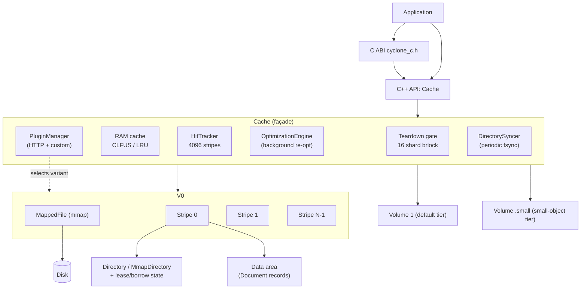
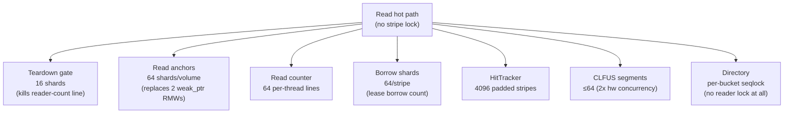
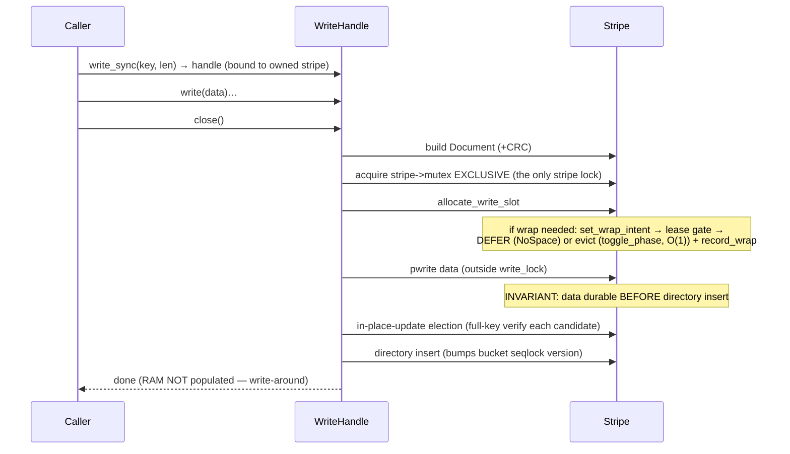

# Cyclone Cache Architecture

This document describes the internal architecture of Cyclone Cache — an Apache-2.0
licensed C++23 shared on-disk + RAM cache library, consumed by mod_pagespeed both
as a C++ API and a C ABI.

> **Ground truth is the source.** Every non-obvious claim below is anchored to a
> file/line under `src/` or `include/cyclone/`. When this doc and the code
> disagree, the code wins — fix the doc. The concurrency model in particular was
> rewritten across the read-path scaling series (lock-free reads, per-thread sharding, read
> leases); this document reflects that rewrite.

## Glossary

| Term | Meaning | Where it lives |
|------|---------|----------------|
| **Stripe (= Segment)** | The cache partitioning unit. The C API `num_segments` (`cyclone_c.h`) and `CacheKey::segment_hash()` (`key.hpp`) refer to the SAME stripes this doc describes — there is exactly ONE partitioning dimension. `stripe_index = key.segment_hash() % num_stripes`. | `key.hpp`, `cyclone_c.h`, "Volumes and Stripes" |
| **Volume** | A single cache file on disk, divided into stripes for parallel access. | `src/core/volume.hpp`, "Volumes and Stripes" |
| **VolumeHeader** | 64-byte header at offset 0; magic `0x43594C4E` ("CYLN") + format major/minor. Format major is **v8**. | `src/core/volume.hpp` (`VolumeHeader`) |
| **Directory entry** | Compact 10-byte key→offset record. Bitfields: `tag` (12-bit collision tag), `phase` (1-bit phase GC), `head` (1-bit, first fragment), `pinned` (1-bit, reserved for do-not-evict — not enforced by eviction today), 40-bit `offset` (byte offset within the stripe; 1 TiB/stripe), `next` (bucket chain). Carries **no key material**. | `src/core/directory.hpp` (`DirEntry`) |
| **Document / fragment** | On-disk record (132-byte header, format major **v8**). The format reserves `FirstFrag`/`MiddleFrag`/`LastFrag` types, but the implementation writes only `SingleFrag` documents today — a document must fit in one stripe's data area (write fails with `NoSpace` otherwise) and under `max_object_size` (`ObjectTooLarge`). | `src/core/document.hpp` (`Document`) |
| **bucket_hash / tag** | Within a stripe, `bucket_hash()` selects the directory bucket; `tag()` is the 12-bit collision tag. | `key.hpp` |
| **Alternate / AlternateId** | A content variant under one key (Original, Brotli, Gzip, WebP, AVIF, JpegXL, Custom…). `AlternateId` normalizes UA capabilities into discrete classes. | `alternate.hpp` |
| **Alternate chain** | Singly-linked list of alternates via `next_alternate_offset`. Directory points to the **head** (newest); **tail** is typically Original (oldest). Max 64 per key. | "Alternate Chains" |
| **CLFUS** | Clock LRU Frequency Size — the default scan-resistant RAM-cache algorithm. Segmented by hardware concurrency. | `clfus.cpp`, "RAM Cache" |
| **Seqlock** | Lock-free directory read: read a per-bucket even/odd version counter, read entries, re-read the counter; retry on mismatch (`kMaxReadRetries = 100`). Used by BOTH the in-memory `Directory` and the mmap `MmapDirectory`. | `directory.hpp`, `mmap_directory.hpp`, `doc/multi-process.md` |
| **Lease / borrow** | Process-local mechanism that makes a zero-copy read aliasing live mmap bytes safe against a concurrent circular-buffer wrap. A reader **borrows** a region and **stamps a lease**; a writer wanting to **wrap** defers while a valid borrow is outstanding. | `volume.cpp`, `doc/multi-process.md`, "Concurrency Model" |
| **Read anchor** | Per-thread strong `shared_ptr` to the Volume + MappedFile, plus a `torn` latch, that keeps the mapping alive for the life of a `ReadHandle` without an RMW on a process-global control block. 64 shards/volume. | `volume.hpp` (`VolumeReadAnchor`) |
| **Phase** | 1-bit directory flag used for O(1) phase-based garbage collection; cross-process toggle is CAS-guarded (`phase_lock`). | `directory.hpp`, `mmap_directory.hpp` |
| **HitTracker** | Deferred, striped hit-recording component. 4096 padded stripes keyed by key hash; flushed periodically to `Document.hit_count`. | `src/core/hit_tracker.hpp` |
| **CRC-validation cache** | Per-volume heap-backed table (65536 slots, 512 KB) that skips re-CRC of an already-verified `{offset, checksum}` pair. Not the overwrite guard — that is the lease/epoch protocol. | `volume.hpp` (`kChecksumCacheSize`) |

## Design Goals

1. **High performance** — minimize latency for cache hits through memory-mapped I/O and a lock-free read path.
2. **Scan resistance** — prevent streaming workloads from evicting frequently-accessed data (CLFUS).
3. **Durability** — written data survives crashes; torn reads are detected by CRC.
4. **Multi-process sharing** — many processes share one cache file safely (mmap directory + seqlocks + leases).
5. **Extensibility** — custom caching policies through plugins.
6. **Cross-platform** — Linux, macOS, Windows.

## System Overview

The `Cache` façade owns the volume set and the shared cross-cutting services
(RAM cache, HitTracker, optimization engine, plugin manager, directory syncer,
and the striped teardown gate). Each `Volume` is one file, divided into
`Stripe`s; each stripe owns a directory and a data area.



**Key → placement.** `CacheKey` is `SHA-256(url[/hostname])` (`key.cpp`). Three
disjoint byte-slices of the digest drive placement:

- `segment_hash()` (bytes 0–3) → **which stripe** (and which volume): `stripe_index = segment_hash() % num_stripes`.
- `bucket_hash()` (bytes 4–7) → **which directory bucket** within the stripe.
- `tag()` (bytes 8–9, 12-bit) → **collision tag** within the 4-entry bucket.

## Component Details

### Cache

`include/cyclone/cache.hpp` (`class Cache`), impl `src/core/cache.cpp`. The orchestrator:
routes keys to volumes (`select_volume`), aggregates statistics, manages
lifecycle (`start`/`stop`/`add_volume`), and carves out the optional isolated
**small-object tier** (`compute_small_tier_sizes`, `add_volume`) so tiny records
don't fragment the main data area. Every public operation guards on the striped
teardown gate and on `running && !stopping` (`lock_and_select`).

### Volumes and Stripes

A **Volume** is a single cache file: `[VolumeHeader 64B][Stripe 0]…[Stripe N-1]`.
A **Stripe** (`volume.hpp` (`struct Stripe`)) is a self-contained sub-region with its own
directory, an append-only `write_pos`, a `std::shared_mutex` (taken by **writers
only**), and all per-stripe lease/borrow state.

**Stripe sizing is automatic by default** (`stripe_size = 0`; `VolumeConfig::stripe_size`, `config.hpp`).
`compute_stripe_geometry` (`volume.cpp`):

- **Auto path** (`stripe_size == 0`): `count = clamp(round(usable / 32 MB), 1, 16)` — `kAutoStripeGranularity = 32 MB`, `kAutoStripeTarget = 16` (`volume.hpp`). The usable region is evenly tiled; the last stripe absorbs the page-aligned remainder (no wasted tail).
- **Explicit path**: fixed stripes, each clamped up to `kMinStripeSize = 128 MB` (`volume.hpp`); a partial tail is dropped.

Why many small stripes matter (the comment above `kMinStripeSize`, `volume.hpp`): the lease wrap gate acts at
**stripe granularity**, so a single-stripe volume would let one long-lived borrow
block *all* writes. Stripe offsets are 8-byte aligned — misaligned `seq_cst`
atomics in an mmap directory SIGBUS on arm64 — enforced by page-flooring.

The volume header persists the authoritative `stripe_count` (`VolumeHeader::stripe_count`,
a field introduced in format v5), so a volume always re-opens with the geometry
it was created with.

### Directory

The directory maps `tag → disk offset` within one stripe. Two interchangeable
implementations, same seqlock read protocol:

- **`Directory`** — in-memory, single-process (`directory.hpp` (`class Directory`)).
- **`MmapDirectory`** — lives in the mmap'd file so multiple processes share it (`mmap_directory.hpp` (`class MmapDirectory`)). Its 64-byte `Header` carries cross-process shared state (phase, `shared_write_pos`, `write_lock`/`phase_lock` CAS spinlocks, and the lease/wrap-intent fields) via `std::atomic_ref`.

#### Entry structure (10 bytes)

```
Word 0: offset[0:15]
Word 1: offset[16:23] │ big[2] │ size[6]
Word 2: tag[12] │ phase[1] │ head[1] │ pinned[1] │ rsv[1]
Word 3: next[16]  (bucket chain pointer)
Word 4: offset[24:39]
```

- **offset** (40 bits) — byte offset within stripe (1 TiB/stripe addressable).
- **big/size** (2 + 6 bits) — encoded size.
- **tag** (12 bits) — collision tag (4096 values).
- **phase / head / pinned** (1 bit each) — GC phase, first fragment; `pinned`
  is reserved for do-not-evict but not currently consulted by eviction.
- **next** (16 bits) — chain to the next entry in the bucket.

Entries are grouped into **buckets of 4** (`bucket_index = bucket_hash() % num_buckets`);
overflow chains via `next`.

#### Collision handling — no key material on disk

A `DirEntry` stores only a 12-bit tag, never the key. So every read that finds a
tag match **re-verifies the full 32-byte `first_key`** against the stored
`Document` (the `first_key` re-check in `Volume::read_sync`), and every in-place update **elects** the target by
full-key verification (the election comment in `Volume::commit_write`) so a colliding foreign key is never
overwritten.

### Document Format

Each cached entry is a document with a 132-byte header (**v8** format,
`document.hpp` (`Document`)). `Document::kVersionMajor` and
`VolumeHeader::kFormatVersionMajor` are kept in lockstep at 8. The format
reserves `FirstFrag`/`MiddleFrag`/`LastFrag` document types for spanning a
large value across fragments, but the implementation writes only
`SingleFrag` documents today (both write sites hardcode `Document::Type::SingleFrag`,
`src/core/volume.cpp`); a document must fit in one stripe's data area (`NoSpace`
otherwise) and under `max_object_size` (`ObjectTooLarge`).

```
Document Header (132 bytes)
├─ magic        uint32_t  0x5F129B14
├─ len          uint32_t  fragment length (header + data)
├─ total_len    uint64_t  total document size
├─ first_key    32 bytes  SHA-256 of the primary key
├─ frag_key     32 bytes  SHA-256 of this fragment
├─ header_len   uint32_t  metadata header size
├─ doc_type     uint8_t   Single / First / Middle / Last fragment (SingleFrag only, in practice)
├─ ver_major    uint8_t   format version (8)
├─ ver_minor    uint8_t   format version
├─ flags        uint8_t   document flags
├─ sync_serial  uint32_t
├─ write_serial uint32_t
├─ pin_until    uint32_t  pin expiration (Unix time)
├─ checksum     uint32_t  CRC-32C over header_data + content
├─ frag_offset  uint32_t  offset within a multi-fragment document
├─ hit_count            uint32_t  persisted hit counter
├─ next_alternate_offset uint64_t offset to next alternate (chain)
├─ alternate_id         uint8_t   AlternateId enum value
├─ last_access          int64_t   Unix timestamp (ms)
├─ Header Data (variable)
└─ Content Data (variable)
```

**Document checksum.** `checksum` is a CRC-32**C** (Castagnoli) over
header_data + content — everything after the 132-byte header. The convention
is part of the on-disk format and is frozen: reflected polynomial
`0x82F63B78`, init `0xFFFFFFFF`, reflected in and out, final XOR
`0xFFFFFFFF`, so `crc32c("123456789") == 0xE3069283`. It lives in
`src/core/crc32c.{hpp,cpp}`, behind `crc32c()` / `crc32c_update()`.

CRC-32C replaced CRC-32/ISO-HDLC at format v8 for one reason: it is the
polynomial *both* mainstream server architectures implement in hardware —
it has a hardware path on x86-64 (SSE4.2 `crc32q`) as well as on ARMv8
(`crc32cx`), where ISO-HDLC has instructions only on ARMv8, leaving x86 on
the table path. On an i7-8750H it runs at 26.5 GB/s (table below). End to
end it takes a cold 2 MiB read on Linux from 1.62 to 2.17 GB/s
([kv-cache-benchmark.md](kv-cache-benchmark.md)).

Implementations, all bit-identical, selected once on first use through a
function pointer (no per-call feature branches):

| Path | When | Apple M5, 2 MiB | i7-8750H, 2 MiB |
|------|------|----------------:|----------------:|
| byte-at-a-time table | reference only (the tests' oracle) | 0.61 GB/s | 0.50 GB/s |
| slice-by-16 tables (portable) | everywhere else | 3.37 GB/s | 2.82 GB/s |
| x86-64 SSE4.2 `crc32q`, 3-way interleaved | CPUID leaf 1 ECX bit 20 (`__get_cpuid` from `<cpuid.h>`; `__cpuid` wherever `_MSC_VER` is defined); the functions carry `target("sse4.2,crc32")` so the project's stock flags are unchanged | — | 26.51 GB/s |
| ARMv8 `crc32cb/w/x`, 3-way interleaved | `__ARM_FEATURE_CRC32`, MSVC ARM64, or `AT_HWCAP & HWCAP_CRC32` on Linux aarch64 | 34.9 GB/s | — |

Best of five `crc32c_bench --seconds 1` runs on an otherwise idle machine
(clang on both; g++-13 reaches 19.3 GB/s on the same i7 loop); a run
sharing the machine with a build loses a few percent. The portable path is
the same slice-by-16 structure as the v7 ISO-HDLC one — the polynomial does
not change its cost, so its rate is unchanged within that noise (3.37 here
against 3.44 measured for ISO-HDLC on the M5, 2.82 against 2.83 on the i7).
Single-stream hardware rates are 12.2 GB/s (M5) and 10.4 GB/s (i7); the
3-way interleave is what lifts both to the figures in the table.

Both hardware paths run **three** independent CRC registers over three
adjacent blocks (8192 bytes, then 256) and stitch them back together with
compile-time-generated GF(2) "advance over N zero bytes" operators: the
`crc32` instruction has ~3 cycles of latency at one per cycle, so a single
dependent chain leaves two thirds of the issue slots idle. On an M5 that is
12.2 → 34.9 GB/s over 2 MiB. `crc32c_bench` times both, and
`crc32c_update_hardware_1way()` exists so the comparison stays honest.

This matters because the CRC-validation cache is per-process: the first
read of an offset, every read after a restart, and every read in a second
process re-verify the whole payload, so the CRC rate is the ceiling on cold
read bandwidth. See [kv-cache-benchmark.md](kv-cache-benchmark.md).

**Format version history** (a volume with a mismatched major version
auto-resets on open when `auto_reset_on_incompatible`, default true,
`config.hpp`; see `doc/multi-process.md` for the full migration story):

| Version | Change |
|---------|--------|
| v3 | mmap directory (multi-process) |
| v4 | auto-derived stripe count |
| v5 | finer stripe granularity + persisted, authoritative `stripe_count` |
| v6 | `hit_count` / `next_alternate_offset` / `last_access` laid out naturally aligned, so the in-place header RMW sites can store them atomically |
| v7 | alternate chains are depth-bounded at write time; the bump leaves pre-bound (over-deep, possibly cyclic) chains behind rather than repairing them |
| v8 | the document checksum is CRC-32C instead of CRC-32/ISO-HDLC; no byte of the layout moved, but every pre-v8 checksum was computed over a different polynomial, so the bump leaves those rings behind |

### Alternate Chains

Multiple variants of content are stored under one key so an optimized form
(e.g. Brotli, AVIF) can be served to capable clients.


- New alternates insert at the head (directory always points to the newest).
- Max **64** alternates per key bounds traversal.
- `AlternateId`: `0` Original; `1–15` compression (Brotli 1, Zstd 2, Gzip 3); `16–31` image (WebP 16, AVIF 17, JpegXL 18); `128–255` plugin-defined.

```cpp
auto wh   = cache->write_alternate_sync(key, AlternateId::Brotli, size);
auto alts = cache->list_alternates_sync(key);
CompressionAwareSelector selector;              // Brotli > Zstd > Gzip > Original
auto rh   = cache->read_alternate_sync(key, selector, ctx);
cache->remove_alternate_sync(key, AlternateId::Gzip);
```

### HitTracker

`hit_tracker.hpp` (`class HitTracker`). `record_hit()` runs on **every** read, so it must not
bounce a cache line. The tracker is **4096 `alignas(128)` stripes** (heap-backed
— inline they overflow a 1 MB thread stack, like `Volume::_checksum_cache`)
keyed by the `CacheKey` hash (`hit_tracker.hpp` (`kNumStripes`, `stripe_index`)): key-striping (not thread-striping)
keeps exactly one record per (key, alternate) so the `_pending_entries` atomic
bound stays exact. It is a **leaf lock** — never held across a flush callback.

Flushes fold in-memory counts into the on-disk `Document.hit_count`:

- **Timer** — every `hit_flush_interval`.
- **Threshold** — a single key exceeds `hit_flush_threshold`.
- **Shutdown** — graceful close flushes all pending hits.

### RAM Cache

Fast in-memory tier keyed by `RamCacheKey{CacheKey, AlternateId}`
(`ram_cache.hpp`). Two implementations; **CLFUS** is the default.

#### CLFUS (Clock LRU Frequency Size) — segmented

Scan-resistant algorithm (`clfus.cpp`):

- **Seen filter** — first access is recorded but not cached; second access admits (streaming one-shots never evict hot data).
- **Value function** — `value = (hits + 1) / (size + 256)`; prioritizes hit rate, cheap for small entries.
- **History list** — tracks recently-evicted entries for smarter re-admission (only if value exceeds the running average).

**Segmentation** (`clfus.cpp` (`pick_segment_count`)) is what keeps the RAM tier from
serializing on one mutex: `pick_segment_count()` = a power of two derived from
`2 × hardware_concurrency` (clamped `[8, 64]`) and the byte budget (≥ 4 MB/segment).
`segment_for()` routes a key by a Fibonacci-mixed hash; **each segment is a
complete, independent CLFUS with its own `shared_mutex`**, active/history LRU
lists, map, seen filter, and byte budget. All alternates of one key share a
segment.

`RamCacheLRU` (`lru.cpp`) is the simpler O(1) doubly-linked-list + hash-map
alternative.

#### Cross-process coherence stamp

Entries carry one opaque `uint32_t` stamp that the RAM cache itself never
interprets. When `CacheConfig::cross_process_ram_coherence` is on, the volume
read path fills it with the shared directory bucket version sampled before the
probe, and revalidates it on every RAM hit — so a peer process's re-record or
purge is not served out of this process's RAM tier. Off (the default), the
stamp is written as 0 and never read. See doc/multi-process.md.

### Memory-Mapped I/O

`MappedFile` (`io/mapped_file.hpp`, impl `mapped_file.cpp`) abstracts POSIX
`mmap`/`pwrite` and Win32 `MapViewOfFile`. The Volume holds it as a `shared_ptr`
so read handles (via read anchors) keep the mapping alive.

- **Reads** map the page-aligned region containing the document and return a span; the OS page cache makes a hot hit zero-copy.
- **Writes** use `pwrite` (clear durability semantics, no torn-write risk), never mmap stores.

**Readahead policy.** The whole-volume mapping is advised `MADV_RANDOM` (plus
`MADV_HUGEPAGE`) once at open. That is the right default for 4 KB HTTP
objects — no readahead pollution, no wasted I/O around a random hit — but it
also suppresses readahead for large documents, so a cold multi-megabyte read
degenerates into one serial page fault per page (≈512 of them for a 2 MiB
document on a 4 KiB-page Linux box). The disk read path
therefore layers a *per-document* hint on top of that blanket advice: once a
candidate's full key has been re-verified and its byte range is known, but
before the CRC pass makes the first content touch, `Volume::read_sync` and the
selected-alternate read path issue a readahead hint over exactly that
document's range when it is at least `CacheConfig::readahead_min_bytes`
(default 256 KiB, 0 = off). The open-time `MADV_RANDOM` is deliberately left
in place, so anything below the threshold keeps its old fault-per-page
behaviour.

**Which kernel call, and why it is per platform.** `MADV_WILLNEED` is
portable in spelling but not in cost, so `Volume::maybe_advise_readahead`
picks by platform. It first calls `MappedFile::advise_readahead(file_offset,
length)`, the *file*-range hint, and falls back to
`MappedFile::advise_willneed(span)`, the *address*-range hint, only where
that reports `std::errc::not_supported`:

| Platform | Call | Why |
|---|---|---|
| Linux | `madvise(MADV_WILLNEED)`, 512 KiB chunks | Queues a few large asynchronous reads and returns; honoured on a file mapping despite `MADV_RANDOM` |
| Darwin | `fcntl(F_RDADVISE)` on the volume fd | Darwin's `MADV_WILLNEED` is synchronous and serialises across processes (below) |
| Windows | `PrefetchVirtualMemory` | Address-range equivalent of the Linux call |

Darwin is the exception that forced the split. Its `madvise(MADV_WILLNEED)`
is not Linux's queue-and-return: it walks and populates the range under the
shared VM object's lock, so it costs far more per call *and* serialises
across every process mapping the same volume. Probed directly on an M5 — one
2 MiB range of a `MAP_SHARED` read-write mapping whose pages are in the
buffer cache but not yet in the caller's page tables — `MADV_WILLNEED` in
512 KiB chunks took **50 µs** with one process and **305 µs** with four
concurrent ones, against **5 µs / 10 µs** for `fcntl(F_RDADVISE)` doing the
same job. Against the four-reader `multiprocess_read` phase of `kv_bench`
that difference is the whole ballgame: the madvise hint cost macOS 85–86 %
of its multi-process read throughput and 29 % of its `restart` throughput,
while `F_RDADVISE` lands inside noise of no hint at all and still buys the
cold-read win. Apple Silicon's 16 KiB base page and Darwin's own clustered
pagein are why the *upside* is smaller there than on Linux in the first
place: a cold 2 MiB read is ~128 faults, not ~512.

Two details are load-bearing on the Linux side. The advice is issued in
512 KiB chunks, because Linux clamps one `MADV_WILLNEED` to
`max(bdi->io_pages, ra_pages)` pages (`force_page_cache_ra()`): a single call
over a 2 MiB document covers only its first ~1.25 MB and the rest still
faults in a page at a time. And the Volume advises a given document
placement at most once every `kReadaheadReadviseSeconds` (2 s), through a
lossy direct-mapped filter (`_readahead_cache`, same shape as the
CRC-validation cache) — on a warm re-read the pages are already resident but
the call still walks the whole range, which unfiltered cost more than the
read itself (warm `view` throughput fell from 261 k to 68 k gets/s for 2 MiB
blocks before the filter went in). The filter matters more, not less, on
Darwin, where four readers re-advising one volume is four times the traffic
through a serialising call.

The filter *decays* rather than remembering forever, because a KV tier is
normally larger than RAM: "advised once, evicted from the page cache, read
cold again" is the common case, and a permanent filter would drop the
readahead exactly where it is worth most. Each slot therefore packs a 40-bit
placement discriminator (offset *and* length, so a reused offset holding a
different document re-advises) with a 24-bit steady-clock second, compared
modularly so the epoch and the ~194-day truncation wrap are both harmless.
The interval only has to be long enough that a hot key cannot pay for a
`madvise()` per read: at 275 k gets/s on one key, 2 s caps it at one hint per
~550 k reads. A collision, a torn pairing or a lost update costs one
redundant or one skipped hint and nothing else, so the filter is never
consulted for correctness and needs no synchronisation — the warm path is a
single relaxed load, and the store happens only when a hint is issued.
`CacheStats::readahead_hints_issued` counts the hints that actually reached
the kernel, which makes the filter observable.

Apart from that one relaxed load/store the hint takes no lock, reads no
shared state and never dereferences the region, so it sits outside the
borrow/lease window and participates in none of the reader protocols; every
error is discarded, because a failed hint only costs the previous behaviour.
`std::errc::not_supported` from `advise_readahead()` is the one answer that
is *not* discarded — it is how the platform says "use the address-range
call instead".

Measured effect on a cold 2 MiB read (Linux, NVMe, median of three runs):
0.120 → 0.446 GB/s with CRC verification on, 0.179 → 2.327 GB/s with it
off. The verified path was then bounded by the checksum (the byte-wise CRC32
of the time, since replaced — see
[Document checksum](#document-format)); with CRC-32C the same read runs at
2.17 GB/s. `MADV_POPULATE_READ` was measured on top of this and did not
help. On macOS the same phases go
0.248 → 0.474 GB/s (first touch) and stay level on `restart`, with the
four-process read phase inside noise; see
[doc/kv-cache-benchmark.md](kv-cache-benchmark.md) for both platforms'
tables.

### Plugin System

Plugins (`plugin/plugin.hpp` (`CachePlugin`)) customize alternate selection, key
generation, freshness, and eviction priority without touching core code. The
built-in **HTTP plugin** (`src/plugin/http/`, gated by `CYCLONE_HTTP_PLUGIN`)
implements HTTP-aware Vary/variant selection, exposed via `Cache::open_read_http`.

### Background Optimization Engine

`optimization/optimization_engine.hpp` (`OptimizationEngine`) re-optimizes cached content in the
background (fed by `on_write_complete`) through `OptimizationPlugin`s, using a
priority `WorkQueue`, an autoscaling `AdaptiveThreadPool`, and a `LoadMonitor`
for load-shedding. Its two-phase stop (`request_stop` / `join_threads`) lets its
workers — which re-enter `Cache::read_sync` — be joined *outside* the teardown
gate.

## Concurrency Model

> This is the part that changed most. The governing invariant of the read-path scaling series
> rewrite is: **a reader never writes to a shared cache line.** Every read-side
> RMW was either eliminated or sharded per thread.

### The sharding map

Each structure that a reader touches is sharded so concurrent readers hit
*different* cache lines. The counts are deliberate:



| Structure | Shards | RMW it eliminates | Source |
|-----------|-------:|-------------------|--------|
| Teardown gate (brlock) | 16 | reader-count line on a single `shared_mutex` | `cache.cpp` (`GateShard`, `GateExclusive`) |
| Read anchors | 64/volume | 2 per-read `weak_ptr` locks on the global Volume+MappedFile control blocks | `volume.hpp` (`VolumeReadAnchor`) |
| Per-volume read counter | 64 | shared read counter increment | `volume.hpp` (`ReadCounterShard`) |
| Borrow shards | 64/stripe | 2 `seq_cst` CAS on one stripe-global borrow slot | `volume.hpp` (`BorrowShard`) |
| HitTracker | 4096 | shared line on `record_hit()` | `hit_tracker.hpp` (`kNumStripes`, `stripe_index`) |
| CLFUS segments | ≤64 | shared-mutex reader-count line on the RAM tier | `clfus.cpp` (`pick_segment_count`) |
| Directory | per-bucket seqlock | the reader-side stripe/shared lock entirely | `directory.hpp`, `mmap_directory.hpp` |

The one shared primitive under all of this is `thread_shard_index()`
(`thread_shard.hpp`): a **round-robin** per-thread index (not an id-hash —
that would birthday-collide), with `kShardPad = 128`.

### Lock-free read path

Readers take **no stripe lock in any mode** — the reader-side lock was dropped in
`read_sync` (`Volume::read_sync`). Correctness rests on four pillars,
documented inline at the "Lock-free read" comment in `Volume::read_sync`:

1. **Directory seqlock** — a torn bucket read is detected and retried (up to `kMaxReadRetries = 100`).
2. **Commit ordering** — data is durable *before* the directory entry is published.
3. **CRC validation** — a torn document (a local writer racing the lock-free reader, or a cross-process wrap) fails its CRC and is treated as a miss/retry.
4. **Lease/epoch protocol** — a borrowed mmap region cannot be wrapped out from under the reader.

An outer retry loop (`max_read_retries + 1`) with `yield()` is the recovery path.

### Per-bucket seqlocks

Both directories use the identical protocol (`Directory::probe_each`,
`MmapDirectory::probe_each`): a reader captures the bucket version, waits for it
to be **even** (writer inactive), acquire-fences, copies the entry, and re-checks
the version after each candidate and once at the end; any change → retry. Writers
publish **odd → even** under the stripe mutex (`begin/end_bucket_write`; mmap
`acquire_writer`/`release_writer` CAS). TSan acquire/release annotations bridge
the pattern for the sanitizer (the seqlock TSan annotations atop `directory.hpp`).

### Read anchors (keeping the mapping alive without a global RMW)

A disk-hit `ReadHandle` aliases live mmap bytes, so the Volume and MappedFile must
outlive it. Instead of two per-read `weak_ptr` locks on process-global control
blocks, `Cache::start` builds `kReadAnchorShards = 64` `VolumeReadAnchor`s per
volume, each holding a strong `shared_ptr<Volume>` + `shared_ptr<MappedFile>` +
a `torn` latch (`volume.hpp` (`VolumeReadAnchor`)). A read copies **its own thread's shard's**
anchor — one refcount RMW on a thread-affine control block. Teardown latches every
anchor `torn = true` before freeing stripes (the stop-time latch in `Cache::stop`), and handles
gate their stripe-touching paths on `anchor->torn`, so a `ReadHandle` may safely
outlive `Cache::stop()`. (Volumes not owned by a Cache — e.g. in unit tests —
fall back to the `weak_ptr` path.)

### Lease-based region pinning

The mechanism that makes a **borrowed, zero-copy read safe under eviction**. A
disk hit aliases bytes that a circular-write-buffer **wrap** could overwrite. The
reader borrows the region and stamps a short lease; a writer that needs to wrap
**defers** while a valid borrow is outstanding. The reader/writer handshake is a
Dekker mutual-exclusion argument in the `seq_cst` total order (proof spelled out
at the wrap-intent site in `Volume::allocate_write_slot`):

```mermaid
sequenceDiagram
    participant Rd as Reader (read_sync)
    participant St as Stripe (shared state)
    participant Wr as Writer (allocate_write_slot)

    Note over Rd,Wr: Both operate lock-free on one stripe; ordering is seq_cst.

    Rd->>St: capture wrap_epoch (probe start)
    Rd->>St: locate + CRC-verify document
    Rd->>St: acquire_borrow  (count+1 on THIS thread's borrow shard)
    Rd->>St: stamp_read_lease (CAS-max now+T; skip if already covers now+3T/4)
    Rd->>St: borrow_still_valid: load wrap_intent FIRST, then re-check epoch
    alt intent set OR epoch moved
        Rd->>St: release borrow, unmap, RETRY
    else clear
        Rd-->>Rd: build ReadHandle (pins via read anchor)
    end

    Note over Wr: writer wants to wrap the region
    Wr->>St: set_wrap_intent(true)   (BEFORE any gate load)
    Wr->>St: lease_permits_wrap: sum ALL borrow shards + load lease expiry
    alt borrow_count != 0 AND lease active
        Wr-->>Wr: DEFER wrap (drop the fill; zero side effects)
        Note over Wr: anti-starvation ceiling (default 60s):<br/>a continuously-deferred wrap is eventually FORCED —<br/>wraps_forced_past_lease++, borrow_force_reset (generation+1)
    else no live borrow
        Wr->>St: evict_if_needed (toggle_phase, O(1)) + record_wrap + set_wrap_intent(false)
    end
```

Key properties:

- **Borrow released on handle close**, not on lease expiry (`~VolumeReadHandleImpl`, `volume.cpp`) — closing a read returns write capacity immediately (the write-starvation fix). `BorrowToken` records the generation + shard so the release lands on the acquiring slot.
- **Write-avoidance** — `stamp_read_lease` skips the CAS if the lease already covers `now + 3T/4`, so back-to-back reads of a hot region don't hammer the lease slot.
- **Crash safety** — `borrow_force_reset` bumps a generation so a crashed holder's leaked borrow count costs at most one ceiling episode.
- **Zero-copy pacing** — a client streaming directly out of the mapping renews with `renew_read_lease` (epoch-only) or `renew_read_lease_strict` (Dekker-ordered; returns `LeaseRenewal{kOk, kCopyNow, kTorn, kLeasesOff}`), and `ns_until_forced_wrap` gives the copy-before-force deadline (`LeaseRenewal` and `ns_until_forced_wrap`, `handle.hpp`). Renewing alone is **not** sufficient: the anti-starvation ceiling is a per-stripe-**episode** bound, not a per-hold budget — a borrow taken late in a deferral episode may have far less than the full ceiling before a forced wrap, so aliased consumers must poll the deadline and copy out in time.
- **Header bytes are volatile** — in-place metadata pwrites (hit-count / last-access updates, alternate chain-repoint) mutate `[0, Document::kHeaderSize)` **without** moving the wrap epoch, so lease/epoch protection covers only the content bytes past `kHeaderSize`. A consumer replicating the whole document must snapshot the header once or re-derive it (`handle.hpp`, mapped-view contract).
- **Phase-ABA positional guard** — a stale directory entry or chain pointer can survive two wraps and point at intact bytes **ahead of the write cursor**; the ordinary forward fill would overwrite them in place with no wrap event (so no lease gate, no intent/epoch revalidation). Both read choke points — the directory probe and the alternate-chain hop — therefore reject at/ahead-of-cursor offsets before a borrow is taken (multi-process compares against `shared_write_pos`). This is what preserves the lease protocol's "any overwrite of a borrowed region is a wrap" premise. Guard: `tests/integration/test_wrap_phase_aba.cpp`.

### Striped teardown gate (big-reader lock)

`cache.cpp` (`GateShard`, `GateExclusive`): 16 `alignas(128) GateShard{shared_mutex}`. A reader takes
**one** shard shared (thread-affine round-robin, `reader_gate()`); an exclusive
holder (`start`/`stop`/`add_volume`) takes **all 16** in order (`GateExclusive`).
Readers never share a reader-count line, yet an exclusive holder still excludes
every reader.

## Multi-Process Mode

Enabled via `MultiProcessConfig` (`MultiProcessConfig`, `config.hpp`). Stripe ownership is
`stripe_index % total_processes == process_index` (`Volume::is_stripe_owned`): **only
the owner writes a stripe**, every process reads every stripe through the mmap
directory.

- **Creator-init race** (the two-stage `O_EXCL` open in `Volume::open`) — `O_CREAT|O_EXCL` picks a creator; an **exclusive file lock** is held across validate + reset + `init_stripes`, so non-creators block until the volume is fully initialized (the header is published *last*). A crash releases the kernel lock and the next opener repairs.
- **fsync** — multi-process mode no longer force-enables `sync_on_write` (forcing it made every write `fsync` the shared inode — an fsync convoy until the fix). Per-write `fsync` now happens **only** when `sync_on_write` (default **false**) is explicitly set, in any mode. Durability comes from the periodic `DirectorySyncer` (`directory_sync_interval`, default 30 s; data fd fsync'd *before* the directory msync) plus one `fsync` per HitTracker flush cycle; the CRC read gauntlet downgrades any torn/unsynced entry to a miss.
- **Cross-process lease/borrow state** lives in the mmap `Header` slots, **frozen at version 1** (`MmapDirectory::Header`, frozen-slot static_asserts). An old-build reader that doesn't count borrows degrades a rolling upgrade to lease-timestamp-only protection (documented at the `Header` borrow-slot comment).

## Data Flow

### Read (hit)

`Cache::read_sync` → `Volume::read_sync` (`Volume::read_sync`):

1. Take **one gate shard shared**, check `running`, route to the volume (`segment_hash`).
2. `select_stripe` (`segment_hash % stripe_count`).
3. **RAM check first** — CLFUS `get` on the key's segment; on hit, build a RAM `ReadHandle` (owns a copied buffer), `record_hit`, return. No borrow/lease.
4. **Disk probe** — capture `wrap_epoch`; run the directory **seqlock read** (no stripe lock). For each tag match: `map_region`, validate the `Document`, **verify `first_key`**, **CRC-verify** unless already in the CRC-validation cache.
5. **Borrow + lease** — `acquire_borrow` (this thread's shard) + `stamp_read_lease` + `borrow_still_valid` (intent-then-epoch). On failure, release + retry.
6. Build the disk `ReadHandle` pinned by **this thread's read anchor**; `record_hit`; return.

Cache lines touched: 1 gate shard, 1 CLFUS segment, 1 directory bucket (seqlock, no lock), 1 borrow shard, 1 lease slot, 1 HitTracker stripe, 1 read-anchor shard, 1 read-counter shard — **all thread-affine or per-bucket, none globally shared.**

### Read (miss)

Same up to the probe; no key-verified match → `NotFound`.
`read_alternate_sync` additionally repopulates the RAM tier on a disk hit
(the post-copy revalidation in `read_alternate_sync`) with a post-copy revalidation (`borrow_still_valid` +
`remove_epoch` recheck) so it never caches torn or resurrected bytes.

### Write

`Cache::write_sync` → `WriteHandle` → `Volume::commit_write` (`Volume::commit_write`):



Only `commit_write` ever takes a stripe lock, and only exclusively. Multi-process
writers reject a non-owned stripe up front. Writes are **write-around** — the RAM
tier is populated on reads, not writes.

## Error Handling

All operations return `std::expected<T, CacheError>`:

```cpp
enum class CacheError {
    None, NotFound, AlreadyExists, NotInitialized, AlreadyOpen, Closed,
    IoError, InvalidArgument, OutOfSpace, Corrupted, InternalError, Busy,
    TooManyAlternates,   // exceeded 64 alternates per key
    AlternateNotFound,
    ChainCorrupted,      // alternate chain has a cycle or invalid offset
    NotOwned             // write to a stripe this process does not own (multi-process)
};
```

**Recovery.** Corrupted entries are detected by CRC and treated as a miss.
An incompatible on-disk format auto-resets (rebuilds) the volume when
`auto_reset_on_incompatible` is set. A torn read retries; a persistently deferred
wrap is force-completed after the anti-starvation ceiling.

## Performance Characteristics

| Operation | Complexity | Notes |
|-----------|------------|-------|
| Key hash | O(n) | SHA-256 of key data |
| Directory probe | O(1) | seqlock read, hash to bucket, scan 4 entries |
| RAM cache get | O(1) | segmented hash-map lookup |
| Disk read (hit) | O(1) | seqlock + mmap + CRC (cached) + borrow/lease |
| Disk write | O(1) amortized | append + directory insert; O(1) phase eviction on wrap |

**Typical latencies (indicative):** RAM hit < 1 µs; disk hit (page cached) 2–5 µs;
disk hit (page fault) 50–200 µs; write 50–100 µs.

---

*See also: [`multi-process.md`](multi-process.md) (cross-process model, seqlock,
CRC-32C, read leases — the authoritative concurrency reference),
[`api-reference.md`](api-reference.md) (complete API),
[`plugin-development.md`](plugin-development.md) (authoring plugins).*
